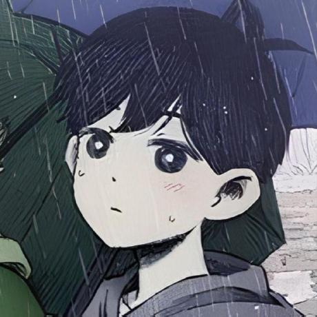

<h1> Welcome to my GitHub! 👋</h1>

</img>

<h2>About Me</h2>

 I am a Computer Science major interested in networks and cybersecurity. First Freshman TA at my university in recent years. Currently, a TA for a Unix command line class (previously a data structures class). I plan on pursuing a Master's Degree in the field. I want to get involved with more projects in the future and I love collaborative work. Online I go by the pseudonym themothershipp and (sometimes) Anđeo. I don't live in Croatia, but I am part Croat 🇭🇷. 

<!-- Projects -->
<h2>Recent Projects - Last Updated 29/09/26</h2>

| Project                                                                            | GitHub                                                                       | Status          |
| ---------------------------------------------------------------------------------- | ---------------------------------------------------------------------------- | --------------- |
| [Logic Gates Website](https://lmu-cmsi2021-fall2026.github.io/spa-themothershipp/) | 🗂 [Repository](https://github.com/lmu-cmsi2021-fall2026/spa-themothershipp) | 🏁 Completed    |
| Computer Systems Org                                                               | 🗂 [Repository](https://github.com/Themothershipp/CMSI-2210_MuhlSchulein)    | ✅ Active       |
| My Flipper Zero Projects                                                           | 🗂 [Repository](https://github.com/Themothershipp/RandomFlipperZeroProjects) | 🪜 More To Come |
| About Me Website                                                                   | ❌ Private                                                                   | 🚧 Just Started |
| Cryptography Website                                                               | ❌ Private                                                                   | 📆 Planned      |

<!-- Statuses
🗂 [Repository]()
🏁 Completed
✅ Active
🪜 More To Come
🛠 In Progress
📆 Planned
-->

<!-- Nimble Olm -->
<h2>GitHub Organization: Nimble Olm Studios</h2>

Nimble Olm is an indie game studio started on February 27, 2026 by <a href="https://github.com/cschulein">cschulein</a> and I. The studio was designed to help us learn game design and maybe publish something in the future. So far 99% of the work has done by <a href="https://github.com/cschulein">cschulein</a>, since I have busy with other projects and assignments, but I do want to be more involved. None of the projects are public at the time of writing.

